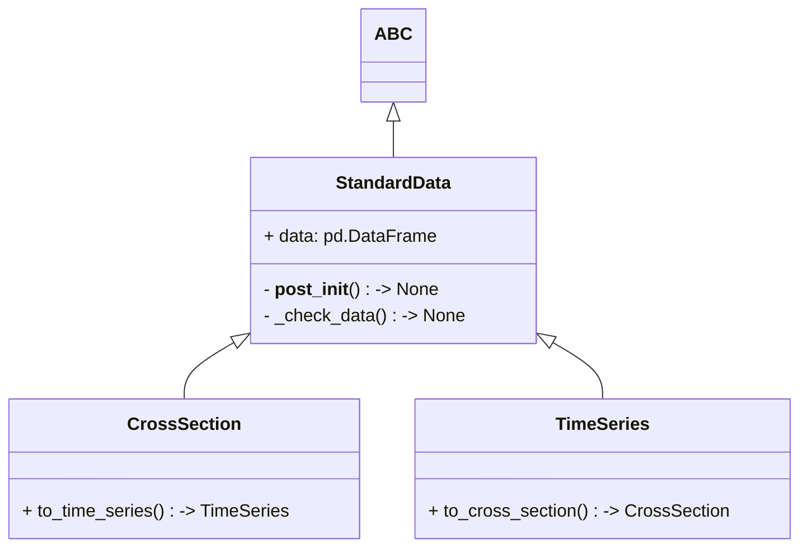

# Standard Data Object

Standard Data Object is a class that provides a standard data structure for the project. It is a simple wrapper around `pandas.DataFrame` with some additional methods. It is used to ensure the data is in a consistent format. Especially for type hinting and data manipulation.

There are two types of data objects in the project:

- class `CrossSection`
- class `TimeSeries`

Both class have similar structure, the main difference is the data structure. The `CrossSection.data` is a `DataFrame` with `TimeStamp` as columns, while the `TimeSeries.data` is a `DataFrame` with `TimeStamp` as index.

In short, you could easily convert one to another by transposing the `DataFrame`.

These standard data objects are used in the project to ensure the data is in a consistent format. Especially for **type hinting** and data manipulation.

