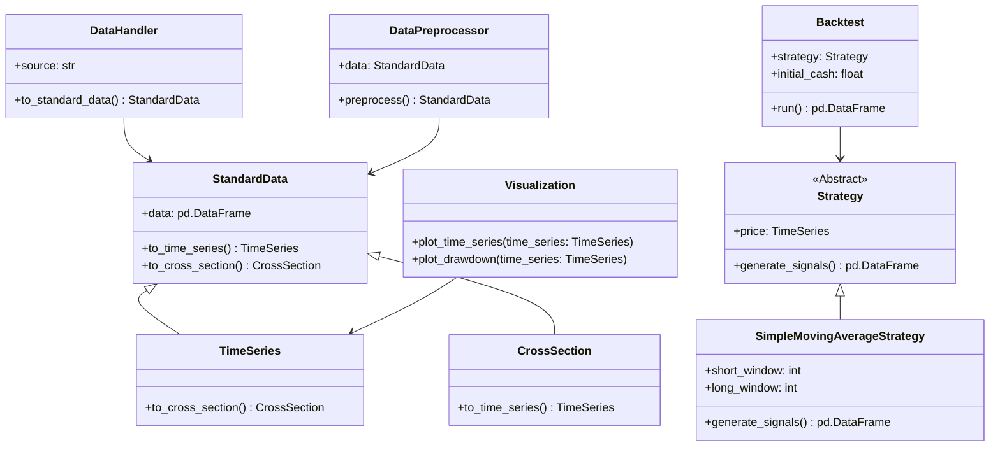
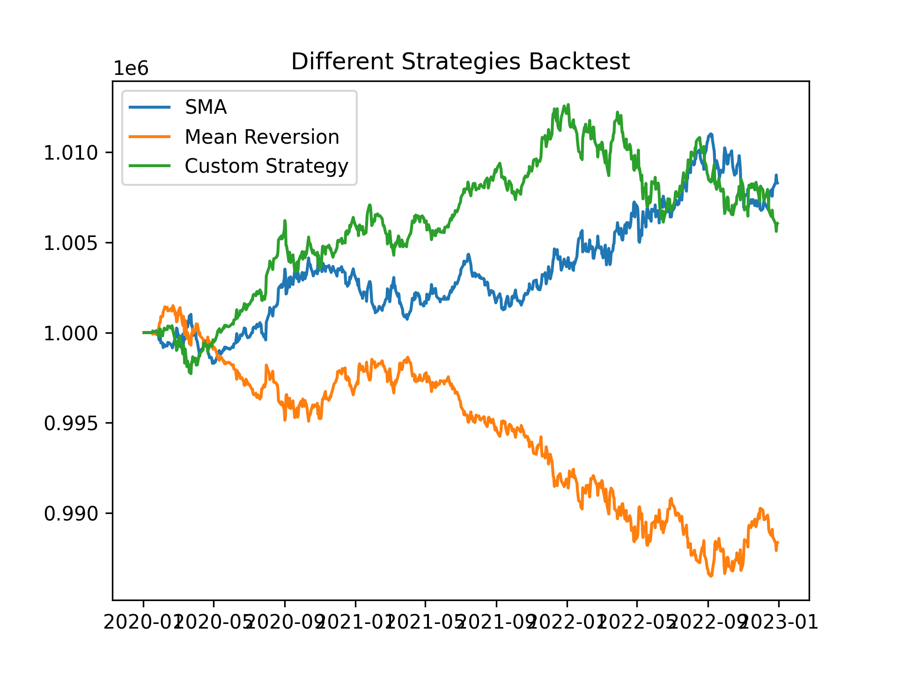
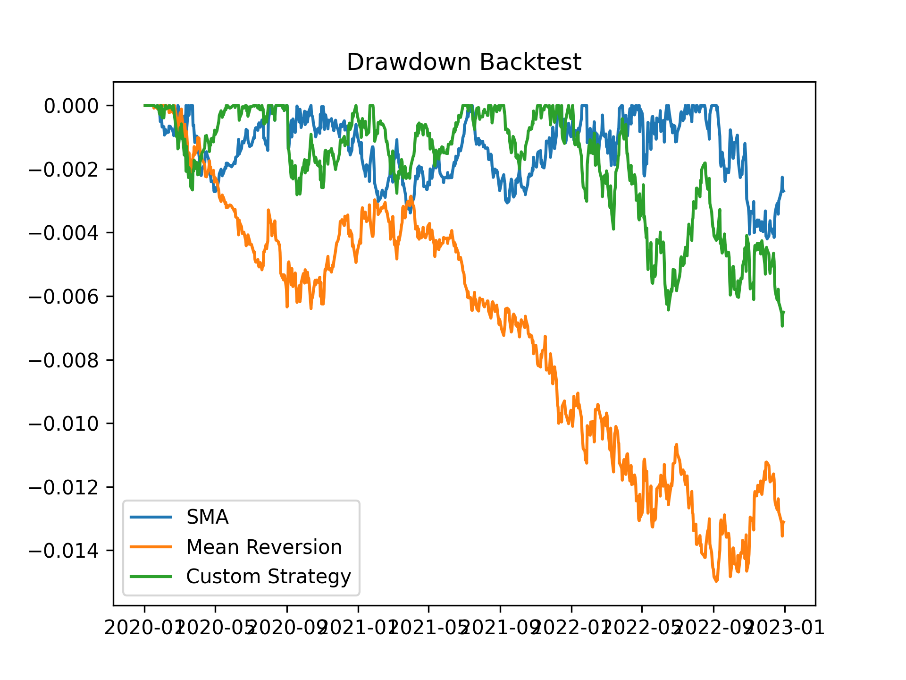

You could find the project on https://github.com/bagelquant/knightrade.


## Project Overview

`Knightrade` is a Python package designed for backtesting. It provides a user-friendly interface for implementing, testing, and optimizing trading strategies. The project emphasizes modularity, scalability, and ease of use, leveraging object-oriented programming (OOP) principles to ensure maintainability and extensibility.

## Objectives

1. **Backtesting**: Simulate trading strategies on historical data to evaluate their performance.
2. **Data Handling**: Standardize and preprocess data for trading strategies.
3. **Visualization**: Provide tools for visualizing portfolio performance and strategy results.

## Key Modules

### 1. **Data Module**

The data module is responsible for handling raw data, transforming it into a standardized format, and preprocessing it for trading strategies.

- **Standard Data**: Provides a consistent data structure (`TimeSeries` and `CrossSection`) for type hinting and manipulation.
- **Data Handler**: Loads data from various sources and converts it into the standard format.
- **Data Preprocessor**: Cleans, normalizes, and transforms data for strategy use.

### 2. **Strategy Module**

The strategy module defines trading strategies that generate buy/sell signals based on market conditions. It includes:

- Abstract base class `Strategy` for defining the interface.
- Concrete implementations like `SimpleMovingAverageStrategy`, `MomentumStrategy`, and `RSI_Strategy`.

### 3. **Backtest Module**

The backtest module simulates the execution of trading strategies on historical data. It calculates portfolio performance, including cash, positions, and total portfolio value over time.

### 4. **Visualization Module**

The visualization module provides tools for plotting time series data and portfolio performance metrics, such as drawdowns.

\newpage

### File Structure

```plaintext
.
|-- src/
|   |-- knightrade/
|   |   |-- __init__.py
|   |   |-- data_module/
|   |   |   |-- __init__.py
|   |   |   |-- data_handler.py
|   |   |   |-- data_preprocessor.py
|   |   |   |-- standard_data.py
|   |   |-- strategy.py
|   |   |-- backtest.py
|   |   |-- visualization.py
|-- docs/
|   |-- attachments/
|   |-- final_report.md
|   |-- strategy.md
|   |-- visualization.md
|   |-- data_module.md
|-- tests/
|-- README.md
|-- pyproject.toml
|-- main.py
|-- LICENSE
```

\newpage

## Object-Oriented Design

The project follows an OOP approach, with clear abstractions and relationships between classes. Below is a mermaid diagram illustrating the design:



## Example Workflow

1. **Data Handling**:
   - Load raw data using `DataHandler`.
   - Convert it to a `TimeSeries` object.

2. **Strategy Definition**:
   - Define a trading strategy, e.g., `SimpleMovingAverageStrategy`.

3. **Backtesting**:
   - Use the `Backtest` class to simulate the strategy on historical data.

4. **Visualization**:
   - Plot portfolio performance and drawdowns using the `Visualization` module.

### Example Code

The following example demonstrates how to use the `Knightrade` package, it will output two figures:

- a portfolio value figure
- a drawdown figure

You could find the figures at the end of this report.

```python
import matplotlib.pyplot as plt
import pandas as pd
from time import perf_counter
from src.knightrade import read_yfinance, TimeSeries
from src.knightrade import SimpleMovingAverageStrategy, MeanReversionStrategy, Strategy
from src.knightrade import Backtest, plot_time_series, plot_drawdown
from dataclasses import dataclass


def main() -> None:
    """
    Main function to demonstrate the usage of the trading strategies.
    """

    # 1. Read data from Yahoo Finance using DataHandler module
    data_time_series = read_yfinance(tickers=["AAPL", "NVDA"], start="2020-01-01", end="2023-01-01", column="Close")

    # 2. Initialize the strategies
    sma = SimpleMovingAverageStrategy(_price=data_time_series,
                                      short_window=10,
                                      long_window=10,
                                      amount=100)
    mean_reversion = MeanReversionStrategy(_price=data_time_series,
                                           window=10,
                                           amount=100)
    # 2.1 Customize a strategy
    @dataclass(slots=True)
    class CustomStrategy(Strategy):
        """
        A simple custom strategy that inherits from Strategy.

        Long only when the price is above the moving average.
        """
        long_window: int        # Moving average window
        amount: float = 100.0   # Amount to buy

        def generate_signals(self) -> TimeSeries:
            """
            Generate buy/sell signals based on the moving average.

            ** This function is required to be implemented in the derived class. **
            ** abstractmethod. **
            """
            price = self._price.data.copy()
            signals = pd.DataFrame(index=price.index, columns=price.columns)
            # set signals type to float
            signals = signals.astype(float)

            # Calculate moving average
            mavg = price.rolling(window=self.long_window, min_periods=self.long_window).mean().shift(1)

            # Generate signals
            signals[price > mavg] = self.amount

            # set signals type to float
            signals = signals.astype(float)
            signals = signals.ffill().fillna(0)
            signals = TimeSeries(signals)
            return signals

    # 2.2 Initialize the custom strategy
    custom_strategy = CustomStrategy(_price=data_time_series,
                                      long_window=10,
                                      amount=100)

    # 3. Run the backtest

    sma_bt = Backtest(strategy=sma, price=data_time_series)
    mean_reversion_bt = Backtest(strategy=mean_reversion, price=data_time_series)
    custom_strategy_bt = Backtest(strategy=custom_strategy, price=data_time_series)

    # 4. Run the backtest
    sma_bt.run()
    mean_reversion_bt.run()
    custom_strategy_bt.run()

    # 4.1 Obtain the portfolio value
    portfolio_value_sma = sma_bt.portfolio.data
    portfolio_value_mean_reversion = mean_reversion_bt.portfolio.data
    portfolio_value_custom_strategy = custom_strategy_bt.portfolio.data
    result = TimeSeries(pd.concat([portfolio_value_sma,
                                   portfolio_value_mean_reversion,
                                   portfolio_value_custom_strategy], axis=1).sort_index())
    result.data.columns = ["SMA", "Mean Reversion", "Custom Strategy"]

    # 5. visualize the results
    fig_portfolio = plot_time_series(result, title="Different Strategies Backtest")
    fig_drawdown = plot_drawdown(result, title="Drawdown Backtest")
    fig_portfolio.show()
    fig_drawdown.show()
    plt.show()


if __name__ == "__main__":
    start_time = perf_counter()
    main()

    end_time = perf_counter()
    print(f"Execution time: {end_time - start_time:.2f} seconds \n or {end_time - start_time:.2f} minutes")
```

## Achievements

- Implemented core modules for data handling, strategy definition, backtesting, and visualization.
- Designed a modular and extensible architecture using OOP principles.
- Established a foundation for future work on optimization.

## Modules Docs

### Data Module

Handles raw data preprocessing and transformation into a standardized format. Includes:

- **Standard Data**: Defines a consistent data structure for type hinting and manipulation.
- **Data Handler**: Converts data from various sources (e.g., local files, Yahoo Finance) into the standard format.

#### Standard Data Object

Standard Data Object is a class that provides a standard data structure for the project. It is a simple wrapper around `pandas.DataFrame` with some additional methods. It is used to ensure the data is in a consistent format. Especially for type hinting and data manipulation.

There are two types of data objects in the project:

- class `CrossSection`
- class `TimeSeries`

Both class have similar structure, the main difference is the data structure. The `CrossSection.data` is a `DataFrame` with `TimeStamp` as columns, while the `TimeSeries.data` is a `DataFrame` with `TimeStamp` as index.

In short, you could easily convert one to another by transposing the `DataFrame`.

These standard data objects are used in the project to ensure the data is in a consistent format. Especially for **type hinting** and data manipulation.

#### Data Handler

Provide an easy interface to convert data from different sources to a standard data object

Data source:
- local file
    - `pandas.DataFrame`
    - `.csv` file
    - `.json` file
    - `.xlsx` file
- remote file
    - `yahoo finance`

This module is a function-based module, all functions are stateless and could be used independently.

### Strategy Module

Defines trading strategies that generate buy/sell signals based on market conditions. Includes:

- Abstract base class `Strategy` for defining the interface.
- Implementations like `SimpleMovingAverageStrategy`, `MomentumStrategy`, `MeanReversionStrategy`, and others.

This module allows users to create custom strategies by inheriting from the `Strategy` class and implementing the `generate_signals` method.

sample custom strategy:

```python
import pandas as pd
from dataclasses import dataclass
from src.knightrade import Strategy, TimeSeries


@dataclass(slots=True)
class CustomStrategy(Strategy):
   """
   A simple custom strategy that inherits from Strategy.

   Long only when the price is above the moving average.
   """
   # add users custom parameters here
   long_window: int  # Moving average window
   amount: float = 100.0  # Amount to buy

   def generate_signals(self) -> TimeSeries:
      """
      Generate buy/sell signals based on the moving average.

      ** This function is required to be implemented in the derived class. **
      ** abstractmethod. **
      """
      
      # Add user custom logic here, signals is a TimeSeries object

      # set signals type to float
      signals = pd.DataFrame()
      signals = TimeSeries(signals)
      return signals
```

#### Abstract Base Class: `Strategy`

The `Strategy` class is an abstract base class that defines the interface for all trading strategies. It includes the following attributes and methods:

- **Attributes**:
  - `price`: A `TimeSeries` object representing the price data.

- **Methods**:
  - `generate_signals()`: An abstract method that must be implemented by all subclasses to generate buy/sell signals.

#### Simple Moving Average Strategy: `SimpleMovingAverageStrategy`

This strategy generates buy/sell signals based on the crossing of two moving averages.

- **Attributes**:
  - `short_window`: The window size for the short moving average.
  - `long_window`: The window size for the long moving average.
  - `amount`: The amount to buy/sell (default is 1.0).

- **Logic**:
  - Buy signals are generated when the price is above the short moving average.
  - Sell signals are generated when the price is below the long moving average.

#### Momentum Strategy: `MomentumStrategy`

This strategy generates buy/sell signals based on the momentum of the price.

- **Attributes**:
  - `window`: The window size for calculating momentum.
  - `amount`: The amount to buy/sell (default is 1.0).

- **Logic**:
  - Buy signals are generated when momentum is positive.
  - Sell signals are generated when momentum is negative.

#### Mean Reversion Strategy: `MeanReversionStrategy`

This strategy generates buy/sell signals based on the mean reversion of the price.

- **Attributes**:
  - `window`: The window size for calculating the rolling mean and standard deviation.
  - `amount`: The amount to buy/sell (default is 1.0).

- **Logic**:
  - Buy signals are generated when the price is below the rolling mean minus one standard deviation.
  - Sell signals are generated when the price is above the rolling mean plus one standard deviation.

#### Bollinger Bands Strategy: `BollingerBandsStrategy`

This strategy generates buy/sell signals based on the Bollinger Bands.

- **Attributes**:
  - `window`: The window size for calculating the rolling mean and standard deviation.
  - `num_std_dev`: The number of standard deviations for the bands.
  - `amount`: The amount to buy/sell (default is 1.0).

- **Logic**:
  - Buy signals are generated when the price is below the lower Bollinger Band.
  - Sell signals are generated when the price is above the upper Bollinger Band.

#### Relative Strength Index (RSI) Strategy: `RSI_Strategy`

This strategy generates buy/sell signals based on the Relative Strength Index (RSI).

- **Attributes**:
  - `window`: The window size for calculating RSI.
  - `overbought`: The RSI threshold for overbought conditions (default is 70.0).
  - `oversold`: The RSI threshold for oversold conditions (default is 30.0).
  - `amount`: The amount to buy/sell (default is 1.0).

- **Logic**:
  - Buy signals are generated when the RSI is below the oversold threshold.
  - Sell signals are generated when the RSI is above the overbought threshold.

### Backtest Module

The `Backtest` class is the core of this module. It simulates the execution of a trading strategy and tracks portfolio performance.

#### Attributes

- **strategy** (`Strategy`): The trading strategy to be backtested. It generates buy/sell signals.
- **price** (`TimeSeries`): Historical price data for the assets being traded.
- **initial_cash** (`float`): The starting cash balance for the backtest. Default is 1,000,000.
- **portfolio** (`TimeSeries`): The total portfolio value (cash + positions) over time.
- **position** (`TimeSeries`): The position sizes for each asset over time.
- **cash** (`TimeSeries`): The cash balance over time.

#### Methods

- **`__post_init__()`**: Initializes the position attribute by generating signals from the strategy.
- **`run()`**: Executes the backtest by calculating portfolio value and cash balance over time.

### Visualization Module

Provides tools for visualizing time series data and portfolio performance metrics, such as drawdowns.

## Future Work

1. **Transaction Costs**: Incorporate transaction costs and slippage into the backtest module.
2. **Performance Metrics**: Add metrics like Sharpe ratio, maximum drawdown, and alpha.
3. **Optimization**: Implement parameter optimization for strategies.
4. **Live Trading**: Extend the package for live trading integration with brokers.

\newpage




