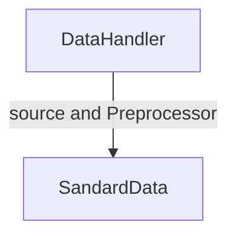
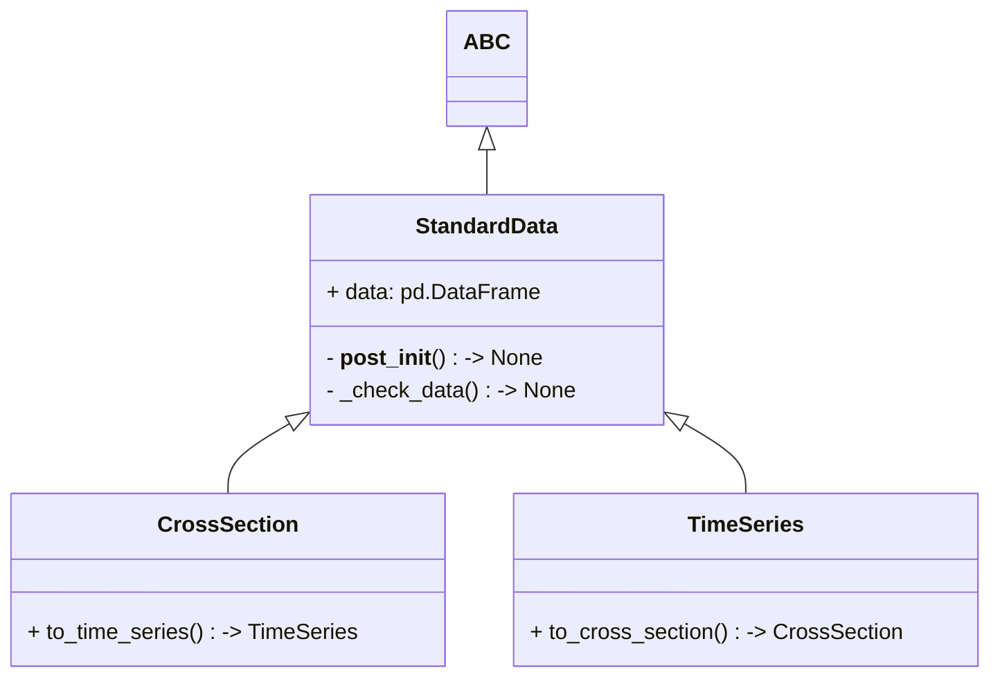
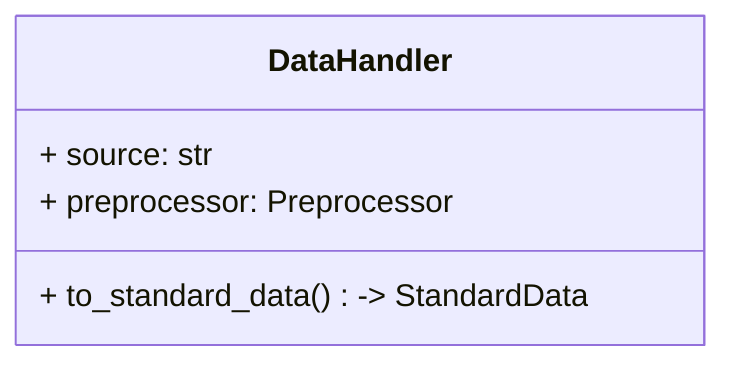
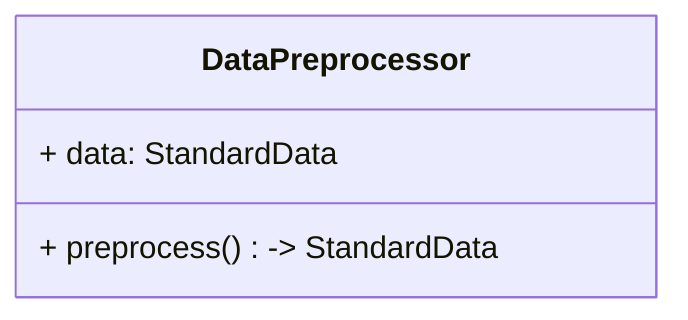

# Midway report

The project could be tracked at https://github.com/bagelquant/knightrade

- [Yanzhong(Eric) Huang](https://github.com/bagelquant)
- [Yongyi Tang](https://github.com/tyyzltrt)
- [Qinqin Huang](https://github.com/QinqinAndMacaulayCat)

## Completed Modules

### Data Module

Responsible for raw data preprocessing and data transformation:

- Standard Data
    - a standard data format for the project.
- Data Handler
    - convert data from different sources to the standard data format
- Data Preprocessor
    - preprocess data for trading strategies.

### Standard Data Object

Standard Data Object is a class that provides a standard data structure for the project. It is a simple wrapper around `pandas.DataFrame` with some additional methods. It is used to ensure the data is in a consistent format. Especially for type hinting and data manipulation.

There are two types of data objects in the project:

- class `CrossSection`
- class `TimeSeries`

Both class have similar structure, the main difference is the data structure. The `CrossSection.data` is a `DataFrame` with `TimeStamp` as columns, while the `TimeSeries.data` is a `DataFrame` with `TimeStamp` as index.

In short, you could easily convert one to another by transposing the `DataFrame`.

These standard data objects are used in the project to ensure the data is in a consistent format. Especially for **type hinting** and data manipulation.

### Data Handler

Data Handler is the main interface to load data from different sources and convert to standard data format. 

- Load data from different sources
- Add a clean method to clean the data
- Convert data to standard data format

### Data Preprocessor

Data Preprocessor is responsible for preprocessing data for trading strategies. 

## Progress records

### Milestones

- [X] 0.0.0: basic setup of the project
- [X] 0.1.0: `data_handler.py` module
- [X] 0.2.0: `data_preprocessor.py` module 
- [ ] 0.3.0: backtest core functinoality 
- [ ] 0.4.0: visualization 
- [ ] 0.5.0: optimization 
- [ ] 0.6.0: async-io 
- [ ] 1.0.0: first release

## 0.0.0

Objective:

- Basic setup of the project
    - Project structure
    - `docs/version_log.md`
    - `docs/conventions.md`
    - `docs/proposal.md`
    - `.gitignore`
    - `pyproject.toml`
- Module design

### Sprint 0

Date: 2025-03-03 - 2025-03-03

Tasks:

- [X] Completed version 0.0.0
- [X] Setup environment

## 0.1.0

DataHandler module

### Sprint 1

- [X] `standard_data.py` module
- [X] `data_handler.py` module

Standard Data Object is a class that provides a standard data structure for the project. It is a simple wrapper around `pandas.DataFrame` with some additional methods. It is used to ensure the data is in a consistent format. Especially for type hinting and data manipulation.

