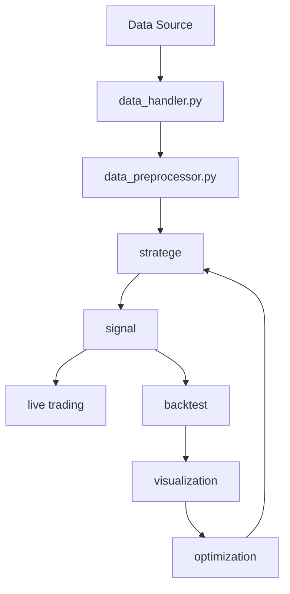

# Proposal

`Knightrade` is a package built on top of `backtrader` that allows users to backtest trading strategies with more advanced features, and allows users to easy construct a live trading environment. The package is designed to be modular, and allows users to easily extend the package with their own modules.

## Authors

- [Yanzhong(Eric) Huang](https://github.com/bagelquant)
- [Yongyi Tang](https://github.com/tyyzltrt)
- [Qinqin Huang](https://github.com/QinqinAndMacaulayCat)

## Features

- Backtest trading strategies
- Construct a live trading environment
- Data preprocessing
- Visualization

## Modules and Data Pipeline



## Core Functionality Design

### Data Handler

Objectives:

- Output a standardized data format

Features:

- Get data from different sources
    - local file: csv, excel, etc.
    - yahoo finance
- Standardize data format
    - double-indexed `pandas.DataFrame`
    - `code` index
    - `datetime` index


### Data Preprocessor

Objectives:

- Preprocess data for trading strategies

Features:

- Data cleaning
- Data normalization
- Data transformation
- Missing data handling
- Outlier detection

### Strategy -> Backtest circuit

Objectives:

- Trading signal generation and backtesting feedback loop

Features:

- Generate trading signals based on strategy (based on `backtrader`)
- Backtest trading signals (based on `backtrader`)
- Visualization (based on `seaborn`)
- Optimization 

### Live Trading

Objectives:

- Using asynchronous IO to construct a live trading environment

## Structure

```plaintext
.
├── src/
│   └── knightrade/
│       ├── __init__.py
│       ├── module1.py
│       └── module2.py
├── tests/
│   ├── __init__.py
│   ├── test_module1.py
│   └── test_module2.py
├── docs/
│   ├── version_log.md
│   ├── convensions.md
│   ├── doc_module1.md
│   └── proposal.md
├── .gitignore
├── LICENSE
├── README.md
└── pyproject.toml
```

## Documentation

- [GitHub](https://github.com/bagelquant/knightrade/)
- [Conventions](https://github.com/bagelquant/knightrade/blob/main/docs/conventions.md)
- [Version Log](https://github.com/bagelquant/knightrade/blob/main/docs/version_log.md)

